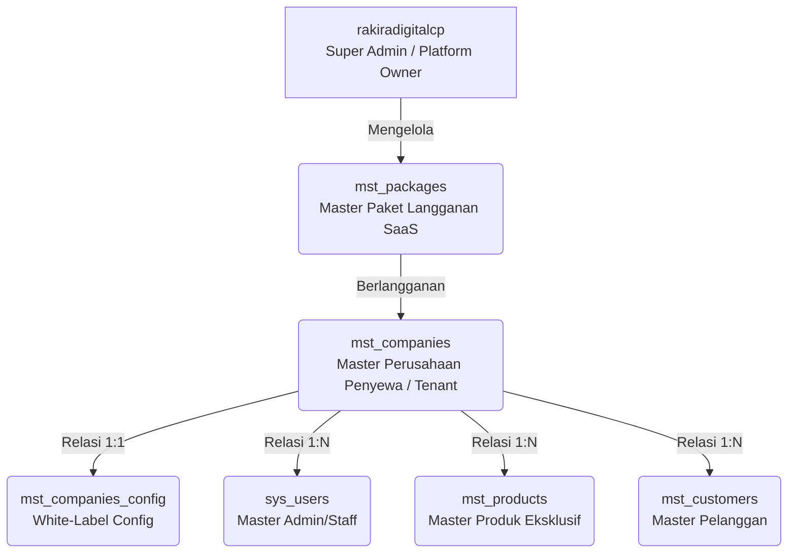

# Arsitektur Master Data SaaS Multi-Tenant Terpusat

Dokumen ini menjelaskan struktur fundamental basis data terpusat untuk platform **SaaS Multi-Tenant** (rakiradigitalcp). Sistem ini menggunakan arsitektur **Star Schema / Top-Down Relationship** yang dirancang untuk skalabilitas, keamanan (Cascade Protection), dan kemudahan pelacakan (Traceability).

## 1. Konsep Hierarki Master Data Terpusat

Data mengalir dari entitas tertinggi (Platform Owner) turun ke entitas penyewa (Tenant), dan kemudian ke data operasional.



Dengan struktur ini, semua tabel operasional wajib memiliki kunci tamu (Foreign Key) yang bermuara pada entitas master ini. Jika terjadi error di sistem, pelacakan kode relasi menjadi sangat terpusat.

## 2. Struktur & Kamus Data Master Terpusat

Standar profesional yang diterapkan pada sistem ini:
- **Primary Key:** Menggunakan **UUID** (ID Sistem acak 36 karakter).
- **Pelacakan Manual:** Menyediakan **Prefix Code** (Kode Manusia) untuk identifikasi instan (misal: `PKG-BASIC`, `CMP-ADI`).
- **Audit Trail:** Dilengkapi dengan `created_at`, `updated_at`, dan `deleted_at` (Soft Deletes).

---

### A. Tabel Master Paket Aplikasi (`mst_packages`)
Tabel ini dikelola penuh oleh Super Admin untuk menentukan jenis layanan/batasan yang disewakan ke perusahaan.
- **Prefix Code:** `PKG`

| Nama Kolom | Tipe Data | Atribut | Keterangan / Contoh Isi |
| :--- | :--- | :--- | :--- |
| `id` (package_id) | UUID | PK, Not Null | ID unik sistem (acak 36 karakter) |
| `package_code` | VARCHAR(20) | Unique, Not Null | Prefix Manusia: `PKG-BASIC`, `PKG-PREMIUM` |
| `package_name` | VARCHAR(50) | Not Null | Nama paket (e.g., "Premium Enterprise") |
| `package_max_products` | INT | Not Null | Batasan sistem (e.g., 1000 produk) |
| `package_price` | DECIMAL(15,2)| Not Null | Harga langganan bulanan/tahunan |
| `created_at` | DATETIME | Not Null | Waktu paket dibuat |
| `updated_at` | DATETIME | Nullable | Waktu paket diubah |
| `deleted_at` | DATETIME | Nullable | Soft Delete: Waktu paket dihapus |

---

### B. Tabel Master Perusahaan Penyewa / Tenant (`mst_companies`)
Tabel paling krusial yang mencatat setiap perusahaan yang mendaftar. Tabel ini menjadi filter utama *Middleware Gatekeeper* untuk mengecek status kedaluwarsa aplikasi.
- **Prefix Code:** `CMP`

| Nama Kolom | Tipe Data | Atribut | Keterangan / Contoh Isi |
| :--- | :--- | :--- | :--- |
| `id` (company_id) | UUID | PK, Not Null | ID unik sistem perusahaan |
| `package_id` | UUID | FK, Not Null | Relasi ke `mst_packages(id)` |
| `company_code` | VARCHAR(10) | Unique, Not Null | Prefix Pelacakan: `ADI` (Adidas), `NKE` (Nike) |
| `company_name` | VARCHAR(100) | Not Null | Nama resmi penyewa (e.g., "PT Adidas Indonesia") |
| `company_domain` | VARCHAR(100) | Unique, Not Null | Subdomain/Domain khusus (e.g., `adidas.rakiradigital.com`) |
| `subscription_status` | ENUM | Not Null | Status: `'active'`, `'suspended'`, `'expired'` |
| `subscription_start_at`| DATETIME | Not Null | Waktu awal mulai langganan |
| `subscription_expired_at`| DATETIME | Not Null | Waktu kedaluwarsa (Target pengecekan Cron Job) |
| `created_at` | DATETIME | Not Null | Audit trail pembuat awal |
| `updated_at` | DATETIME | Nullable | Audit trail pengubah terakhir |
| `deleted_at` | DATETIME | Nullable | Soft Delete |

---

### C. Tabel Master Konfigurasi Aplikasi (`mst_companies_config`)
Menyediakan fitur *White-Label*. Tampilan aplikasi mobile dan web bisa berubah secara dinamis sesuai identitas perusahaan (warna, logo, API keys).
- **Prefix Code:** `CFG`

| Nama Kolom | Tipe Data | Atribut | Keterangan / Contoh Isi |
| :--- | :--- | :--- | :--- |
| `id` (config_id) | UUID | PK, Not Null | ID unik konfigurasi |
| `company_id` | UUID | FK, Unique, NN | Relasi 1:1 ke `mst_companies(id)` |
| `cfg_app_logo` | VARCHAR(255) | Not Null | Path URL file logo toko di server |
| `cfg_primary_color` | VARCHAR(7) | Not Null | Kode warna HEX (e.g., `#000000` untuk hitam) |
| `cfg_secondary_color`| VARCHAR(7) | Not Null | Kode warna HEX pembantu (e.g., `#FFFFFF`) |
| `cfg_payment_api_key`| TEXT | Nullable | API Key Midtrans/Xendit milik penyewa (terenkripsi) |
| `created_at` | DATETIME | Not Null | Waktu dibuat |
| `updated_at` | DATETIME | Nullable | Audit trail perubahan |

---

## 3. Keunggulan Sistem & Integrasi Kedepan

### A. Efek Domino Keamanan (Cascade Protection)
Tabel `mst_companies` mengunci level tertinggi aplikasi penyewa.
Jika Super Admin mengubah status di `mst_companies` menjadi `expired`, maka seluruh data di tabel turunan yang memiliki `company_id` tersebut otomatis ikut terkunci di level *Backend Middleware*. Data tidak terhapus, namun akses API dan Front-end akan langsung terblokir tanpa perlu mengunci data produk atau user satu per satu.

### B. Kemudahan Tracing & Debugging (Prefix Identifier)
Jika terjadi masalah pada transaksi, sistem akan menghasilkan log/invoice seperti: **`INV-ADI-20260604-001`**.
Dari format ini, Tim Developer dapat langsung mengidentifikasi:
- **`INV`** = Tabel transaksi pesanan (`trx_orders`).
- **`ADI`** = Kode unik dari tabel master perusahaan (`mst_companies`).
- **`20260604`** = Tanggal kejadian.

Konten log akan mencatat kecocokan UUID `company_id`, sehingga pelacakan data menjadi sangat instan dan dijamin tidak tertukar antar penyewa.

### C. Keterhubungan Dengan Sistem Lain (Interoperabilitas)
Sistem ini dirancang sebagai API-First Core.
- **Microservices & Mobile Apps:** Subdomain tenant (e.g. `api.adidas.rakiradigital.com`) akan selalu mengirimkan request yang divalidasi oleh Middleware yang mengecek kombinasi Domain dan `company_id`. 
- **Payment Gateway:** Setiap transaksi menggunakan `cfg_payment_api_key` unik dari tabel config masing-masing perusahaan, sehingga perputaran uang langsung masuk ke rekening tenant tanpa tercampur dengan tenant lain.
- **Reporting System:** Pengelompokan metrik dan analitik tinggal melakukan klausa `GROUP BY company_id` di seluruh tabel operasional.

---

## 4. Panduan Implementasi & Integrasi (Pemasangan)

Bagian ini menjelaskan bagaimana mengimplementasikan arsitektur keamanan dan Master Data SaaS di atas ke dalam kode aplikasi.

### A. Bagaimana Cara Menyambungkannya? (Pemasangan di Rute/Link)
Cara menyambungkannya sangat mudah. Anda hanya perlu "membungkus" rute-rute (*links*) halaman klien Anda di file `routes/web.php` atau `routes/api.php` dengan alias Middleware `tenant.active` yang sudah kita buat.

**Contoh Penulisan di `routes/web.php`:**
```php
// Rute Publik (Bebas diakses siapa saja)
Route::get('/', [LandingPageController::class, 'index']);

// Rute Klien/Tenant (Hanya bisa diakses jika sudah login DAN langganan aktif)
Route::middleware(['auth', 'tenant.active'])->group(function () {
    
    // Semua halaman di dalam sini aman dari penyewa yang nunggak bayar!
    Route::get('/admin/dashboard', [DashboardController::class, 'index']);
    Route::get('/admin/products', [ProductController::class, 'index']);
    Route::post('/admin/products/create', [ProductController::class, 'store']);
    
});
```
Hanya dengan membungkus rute di atas, Middleware `CheckTenantSubscription` akan otomatis bekerja menjaga pintu masuk tersebut.

### B. Bagaimana Sistem Kerjanya di Lapangan?
Mari kita buat simulasi alur ceritanya:
1. **Pendaftaran:** Perusahaan "PT Kopi Senja" berlangganan SaaS Anda selama 1 bulan. Super Admin Anda (`rakiradigitalcp`) membuatkan data di `mst_companies` dan mengatur `subscription_expired_at` pada **4 Juli 2026**.
2. **Kondisi Normal:** Selama bulan Juni, setiap kali Admin Kopi Senja login dan klik menu `/admin/products`, Middleware `tenant.active` mengecek, *"Oh, masih aktif dan belum tanggal 4 Juli. Silakan lewat."*
3. **Masa Kritis (Tengah Malam 4 Juli):** Pada jam 00:00, Cron Job `tenant:check-expired` berjalan secara otomatis di server. Skrip melihat tanggal sudah melewati batas, lalu mengubah status Kopi Senja di database menjadi `expired`.
4. **Pemblokiran:** Pagi harinya jam 08:00, Admin Kopi Senja mencoba login. Middleware mencegatnya, melihat statusnya `expired`, lalu langsung melakukan Logout paksa dan mengarahkan Admin ke halaman login dengan pesan merah: *"Masa berlangganan perusahaan Anda telah habis. Silakan hubungi Super Admin."*

### C. Bagaimana Penyesuaian di Sistem yang Akan Kita Buat (Untuk Klien)?
Ketika kita men-develop antarmuka (UI) dan fitur untuk klien, ada **2 penyesuaian wajib** yang harus diterapkan di seluruh halaman aplikasi:

#### 1. Penyesuaian Tampilan (White-Labeling)
Karena ini SaaS, aplikasi Kopi Senja dan aplikasi Sepatu Adidas menggunakan basis kode yang sama tapi tampilannya harus berbeda. Di file view (misal: Blade), kita akan memanggil data dari tabel `mst_companies_config`.

```html
<!-- Menampilkan Logo Klien Secara Dinamis -->
user()->company->config->cfg_app_logo }}" alt="Logo Klien">

<!-- Mengubah Warna Tema Klien Secara Dinamis -->
<style>
    :root {
        --primary-color: {{ auth()->user()->company->config->cfg_primary_color }};
    }
</style>
```

#### 2. Penyesuaian Filter Data (Isolasi Data)
Agar Admin Kopi Senja tidak bisa melihat daftar produk milik Sepatu Adidas, setiap kali memanggil data dari database di Controller, kita **WAJIB** menyaringnya berdasarkan `company_id`.

```php
// ❌ CONTOH SALAH (Semua produk dari semua perusahaan akan tercampur)
$products = Product::all(); 

// ✅ CONTOH BENAR (Hanya mengambil produk milik perusahaannya sendiri)
$products = Product::where('company_id', auth()->user()->company_id)->get();
```

*(Catatan: Ke depannya, kita bisa membuat filter `where('company_id', ...)` ini otomatis bekerja tanpa perlu ditulis manual menggunakan fitur **Global Scope** di Laravel).*

---

### Kesimpulan
Dengan fondasi yang sudah kita pasang ini, tugas kita selanjutnya saat membuat fitur-fitur baru (seperti Kasir, Laporan, atau Katalog) hanyalah:
1. **Menambahkan kolom `company_id`** di setiap tabel operasional baru.
2. **Membungkus rutenya** dengan Middleware `tenant.active`.
3. **Memastikan filter `$user->company_id`** selalu dipakai saat menarik data di Controller.
