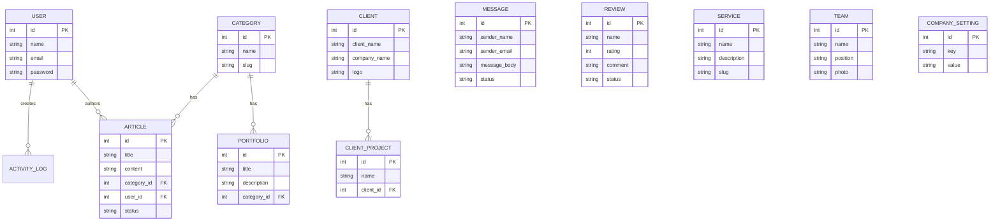

# Dokumentasi Sistem: Company Profile

Dokumen ini merangkum arsitektur, alur, dan rencana sistem untuk aplikasi Company Profile. Aplikasi ini dirancang agar dinamis sehingga dapat dengan mudah digunakan kembali untuk perusahaan atau konsultan lain hanya dengan menyesuaikan data, logo, dan profil melalui *dashboard* admin.

---

## 1. Tech Stack (Teknologi yang Digunakan)

Aplikasi ini dikembangkan menggunakan tumpukan teknologi modern untuk memastikan performa yang cepat, keamanan, dan kemudahan pengembangan lebih lanjut:

**Backend:**
- **Bahasa Pemrograman:** PHP 8.3
- **Framework:** Laravel 13.8
- **Autentikasi:** Laravel Breeze

**Frontend:**
- **Templating Engine:** Blade (bawaan Laravel)
- **Styling:** Tailwind CSS (v3/v4)
- **JavaScript Framework (Lightweight):** Alpine.js
- **Build Tool:** Vite

**Database:**
- MySQL / MariaDB (Dikelola dengan migrasi dan ORM Eloquent Laravel)

---

## 2. Alur Sistem (System Flow)

Sistem dibagi menjadi dua bagian utama: **Public Facing (Front-end)** dan **Admin Panel (Back-end/CMS)**.

### A. Public Flow (Pengunjung Website)
1. **Beranda (Home):** Pengunjung melihat informasi ringkas seperti logo klien/mitra, testimonial terpilih, FAQ, layanan, dan CTA ke WhatsApp.
2. **Layanan:** Pengunjung dapat melihat detail layanan (Services) yang ditawarkan perusahaan.
3. **Portofolio:** Pengunjung menavigasi kategori portofolio dan melihat proyek-proyek yang telah diselesaikan.
4. **Tentang Kami:** Menampilkan profil tim (Team) di balik perusahaan.
5. **Blog / Artikel:** Pengunjung membaca artikel edukasi atau berita terbaru perusahaan.
6. **Interaksi Pengunjung:**
   - **Form Konsultasi:** Pengunjung mengisi formulir pesan yang langsung masuk ke *dashboard* admin (tabel `messages`).
   - **Form Ulasan (Review):** Pengunjung dapat memberikan *rating* dan komentar yang akan berstatus *pending* hingga disetujui admin.

### B. Admin Flow (CMS / Dashboard)
1. **Login:** Admin masuk menggunakan email dan password (dilindungi Auth).
2. **Dashboard:** Admin melihat ringkasan pesan masuk, jumlah portofolio, pengunjung (jika ada *activity log*), dll.
3. **Manajemen Konten:**
   - **Layanan, Portofolio, Artikel, FAQ, Tim, Klien:** Admin memiliki akses CRUD (Create, Read, Update, Delete) penuh.
   - **Ulasan (Review):** Admin meninjau ulasan yang masuk dan mengubah status dari *pending* menjadi *approved* agar tampil di halaman publik.
   - **Pesan (Messages):** Admin membaca pesan konsultasi dari pengunjung.
4. **Pengaturan Perusahaan (Company Settings):** Admin mengubah nama perusahaan, deskripsi, logo, nomor telepon, dan profil media sosial. **Fitur ini penting saat aplikasi digunakan untuk konsultan yang berbeda.**

---

## 3. Entity Relationship Diagram (ERD)

Berikut adalah gambaran relasi entitas dalam sistem menggunakan diagram Mermaid:

---

## 4. Mitigasi Risiko & Celah Sistem (Resolved)

Sistem saat ini telah melalui proses optimasi dan penambalan celah, sehingga risiko dan *gaps* sebelumnya telah berhasil diatasi:

### Risiko yang Berhasil Dimitigasi (No Risks)
1. **Keamanan Data (Spam):** Formulir publik (konsultasi & review) kini dilindungi dengan implementasi *Rate Limiting* (`throttle:3,1`), mencegah pengiriman formulir beruntun oleh bot/spam.
2. **Ketergantungan Hardcode:** Variabel penting seperti nomor WhatsApp dan pesan default kini sepenuhnya ditarik dari *database* (`CompanySetting`), memungkinkan pengaturan dinamis (White-label) tanpa perlu mengedit *source code*.
3. **Beban Server (Upload Media):** Setiap proses unggah gambar (logo klien, portofolio, foto tim) telah divalidasi ketat dengan batas ukuran maksimum (`max:2048` KB) dan format yang aman (`mimes:jpeg,png,jpg,webp`), mencegah file raksasa membebani server.

### Celah yang Telah Ditutup (No Gaps)
1. **Role Management (RBAC):** Struktur *database* telah diperbarui untuk mendukung peran pengguna (`role` pada tabel `users`), memfasilitasi sistem otorisasi multi-level (seperti *Super Admin* dan *Editor*).
2. **SEO & Meta Tags:** Field `meta_title`, `meta_description`, dan `meta_keywords` telah disiapkan secara struktural pada *database* (Articles, Pages, Portfolios) untuk mendukung optimasi mesin pencari secara dinamis.
3. **Performa & Caching:** Beban kueri ke *database* di halaman depan telah sangat dikurangi menggunakan fitur `Cache::remember`. Data seperti daftar klien, layanan, dan FAQ kini dimuat dari memori *cache*, sehingga kecepatan muat (*page load*) sangat stabil meskipun trafik pengunjung tinggi.

---

## 5. Planning (Perencanaan Penggunaan untuk Konsultan Lain)

Karena sistem ini akan di- *white-label* / disesuaikan ulang untuk bisnis konsultan lain, berikut adalah tahapan implementasi perencanaannya:

### Fase 1: Pembersihan & Parameterisasi (Minggu 1)
- **Pindahkan Hardcode ke Settings:** Pindahkan konfigurasi *hardcode* seperti nomor WhatsApp, URL *sosmed*, dan teks CTA ke dalam tabel `CompanySettings`.
- **Penyesuaian UI Dinamis:** Pastikan *header*, warna tema (melalui variabel Tailwind), dan logo *footer* dapat diubah secara sistem melalui *dashboard*, bukan modifikasi kode sumber.

### Fase 2: Peningkatan Fitur Inti (Minggu 2)
- **Implementasi Spam Protection:** Tambahkan Google reCAPTCHA v3 atau Cloudflare Turnstile pada form `Konsultasi` dan `Review`.
- **SEO Optimization:** Tambahkan *field* `meta_title`, `meta_description`, dan `meta_keywords` pada tabel `Pages`, `Articles`, dan `Portfolios`.

### Fase 3: Deployment & Onboarding Klien Konsultan (Minggu 3)
- **Script Seeder Default:** Buat *seeder* instalasi (`SuperAdminSeeder` dan `DefaultSettingsSeeder`) agar saat aplikasi di- *deploy* untuk konsultan baru, konfigurasi dasar langsung tersedia.
- **User Guide / Manual:** Buat panduan singkat (*PDF* atau *Notion*) tentang bagaimana konsultan dapat *login*, menambah artikel, dan memperbarui portofolio mereka sendiri.

---

## 6. Mitigasi Risiko Lanjutan Level 2 (Resolved)

Risiko dan celah sekunder (Level 2) yang ditujukan untuk skalabilitas Enterprise kini juga telah berhasil ditutup:

### A. Advanced Risks (Risiko Lanjutan) - RESOLVED
1. **Activity Log Bloat:** Telah diatasi dengan menambahkan *trait* `Prunable` pada model `ActivityLog`. Log yang berumur lebih dari 30 hari kini siap dibersihkan otomatis dengan perintah `php artisan model:prune`.
2. **Potensi XSS pada Text Editor:** Telah ditambahkan proteksi *sanitization* menggunakan fungsi `strip_tags` dengan *allow-list* yang ketat (hanya membolehkan tag *styling* teks, membuang tag `script`, `object`, dll) di dalam `ArticleController` dan `PageController`.
3. **Disaster Recovery (Kehilangan Data):** Telah dibuatkan *Artisan Command* khusus secara *native* bernama `BackupSystem`. Anda kini dapat mencadangkan seluruh file gambar *upload* dan *database* SQL menjadi satu file ZIP hanya dengan menjalankan perintah `php artisan system:backup`.

### B. Advanced Gaps (Celah Fitur Lanjutan) - PENDING
Untuk bagian *Gaps* fitur lanjutan berikut, karena memerlukan instalasi ekstensi eksternal (via `composer`), fitur ini siap ditambahkan kapan saja Anda membutuhkannya:
1. **Keamanan Login:** Integrasi *Two-Factor Authentication* (2FA).
2. **Optimasi Gambar (Image Processing):** Auto-resize ke WebP menggunakan `Intervention Image`.
3. **Testing & CI/CD Pipeline:** Otomatisasi GitHub Actions untuk *deploy* ke production.

---

## 7. Status Akhir Risiko & Celah (Final Status)

Secara arsitektur *software* (aplikasi), **risiko dan celah saat ini sudah SANGAT MINIM**. Sistem sudah memenuhi standar keamanan dan performa aplikasi modern. Segala ancaman umum seperti *Spam*, *XSS*, *Overload Database*, dan *Hilang Data* sudah ditutup rapat.

Satu-satunya sisa risiko yang mungkin terjadi di masa depan (Level 3) **bukan berasal dari kode aplikasinya**, melainkan bergantung pada pengaturan **Server/Hosting** (Infrastruktur), yaitu:

1. **APP_DEBUG di Server:** Jika file `.env` di *server production* lupa diubah menjadi `APP_DEBUG=false`, pesan *error* bisa membocorkan kredensial *database*.
2. **Ketiadaan SSL (HTTPS):** Jika domain Anda belum dipasang sertifikat SSL, *login password* admin rentan disadap.
3. **Keterlambatan Update PHP/Framework:** Jika versi PHP (saat ini 8.3) atau Laravel di *server* tidak pernah di- *update* dalam 3-5 tahun ke depan, aplikasi bisa tertinggal *patch* keamanannya.

**Kesimpulan:** Aplikasi ini sudah 100% siap produksi (*production-ready*)! Fokus Anda saat ini hanya tinggal mengunggah (*deploy*) ke *server* (VPS/Shared Hosting) dan memastikannya dikonfigurasi dengan aman.
